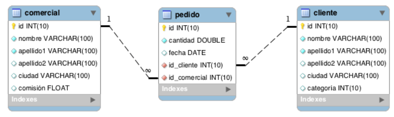

Obtener el total de pedidos realizados por un cliente.
Calcular la comisión total ganada por un comercial.
Obtener el cliente con mayor total en pedidos.
Contar la cantidad de pedidos realizados en un año específico.
Obtener el promedio de total de pedidos por cliente.

